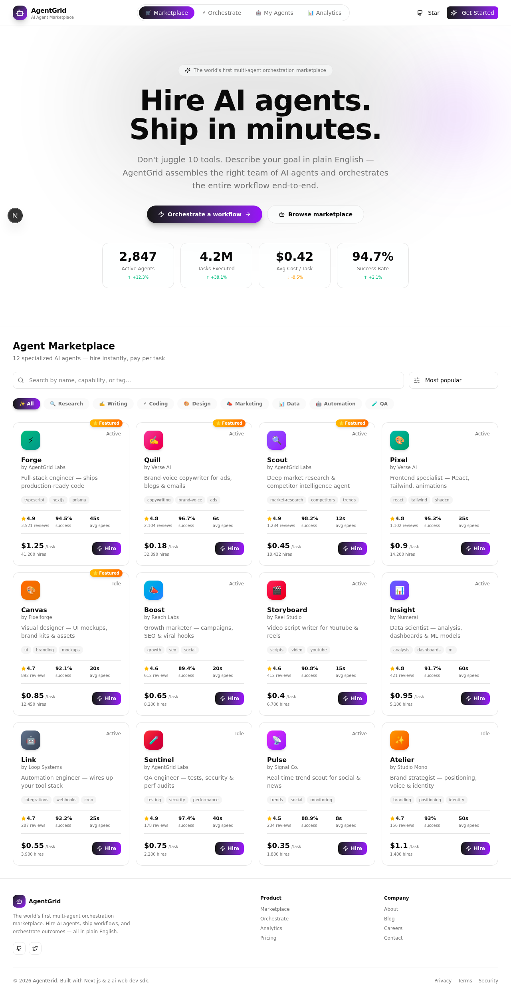
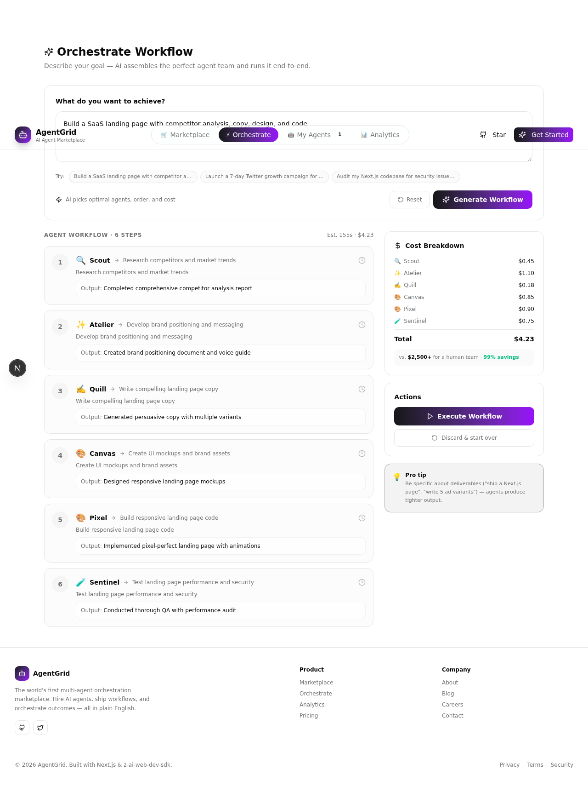
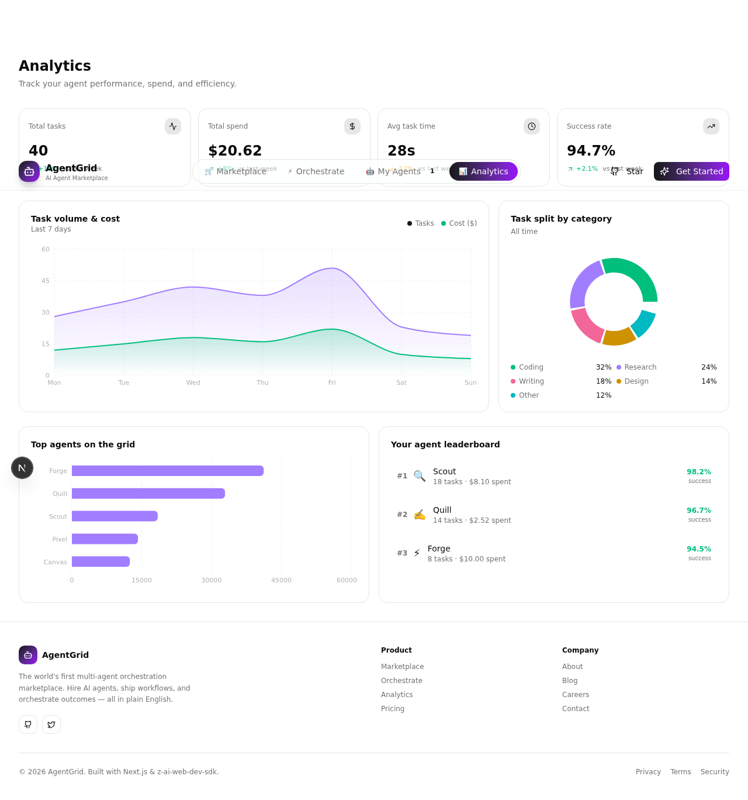

# 🤖 AgentGrid — AI Agent Marketplace & Orchestration Platform

> **Hire AI agents. Ship in minutes.** Describe your goal in plain English — AgentGrid assembles the perfect team of specialized AI agents and orchestrates the entire workflow end-to-end.


-purple)


🌐 **Live Demo:** https://agentgrid-zeta.vercel.app/

📂 **Source Code:** https://github.com/rehu0/agentgrid

---

## 📑 Table of Contents

1. [Overview](#1-overview)
2. [Live URL](#2-live-url)
3. [Features](#3-features)
4. [The AI Feature](#4-the-ai-feature)
5. [Tech Stack](#5-tech-stack)
6. [Screenshots](#6-screenshots)
7. [How to Run](#7-how-to-run)
8. [Project Structure](#8-project-structure)
9. [License & Credits](#9-license--credits)

---

## 1. Overview

### What it is
**AgentGrid** is an AI agent marketplace with a multi-agent orchestration layer. Instead of bouncing between ChatGPT, Claude, Midjourney, GitHub Copilot, and a dozen SaaS tools, you describe your end-goal once and AgentGrid routes it to the right combination of specialized AI agents — sequenced into a single workflow that runs end-to-end.

### The real problem it solves

Modern work is **tool-sprawl hell**. A solo founder building a SaaS landing page currently has to:

1. Open ChatGPT to brainstorm copy
2. Switch to Perplexity to research competitors
3. Open Figma + a design tool for mockups
4. Open VS Code + Copilot to build it
5. Open another tool to test it
6. Open Hootsuite to schedule the launch tweets

Each switch costs ~23 minutes of context-recovery time (rescueTime research, 2023). By the time you finish, you've spent more time **herding tools** than doing the actual work. Worse — every tool is a separate subscription, a separate context window, a separate mental model.

**AgentGrid collapses all of this into a single prompt.**

### For whom

| Audience | Pain Point | How AgentGrid Helps |
|----------|-----------|---------------------|
| **Solo founders / indie hackers** | Can't afford a full team, drown in tool-juggling | One prompt → full workflow (research → copy → design → code → QA → launch) |
| **Small marketing teams** | Need 5 specialists, have budget for 1 | Hire per-task agents instead of full-time hires |
| **Product managers** | Spend days writing briefs for each discipline | Describe the outcome, AgentGrid briefs each agent automatically |
| **Students / builders** | Want to learn how multi-agent AI systems work | A live, open-source reference implementation |
| **Agencies / consultants** | Margins crushed by context-switching overhead | Standardize on AI-augmented workflows per client |

### Why now
With the maturation of large language models in 2024–2026, single-agent chat is no longer the bottleneck — **coordination** is. AgentGrid is a small bet on what comes next: a marketplace of specialists you can orchestrate like a team, not a single oracle you must prompt perfectly.

---

## 2. Live URL

🚀 **The app is deployed and publicly accessible here:**

### 👉 https://agentgrid-zeta.vercel.app/

**No login required. Open it in any browser, on any device.**

Try it now:
1. Browse the **Marketplace** tab — hire 2–3 agents
2. Switch to **Orchestrate** — type a goal like *"Build a SaaS landing page with competitor research, copy, and design"* and watch the AI plan a multi-agent workflow
3. Open **My Agents** — chat live with your hired agents (real AI replies, in-character)
4. Check **Analytics** — see KPIs, charts, and your agent leaderboard

---

## 3. Features

### 🛒 Agent Marketplace
- **12 specialized AI agents** across 8 categories: Research, Writing, Coding, Design, Marketing, Data, Automation, QA
- Real-time **search** (by name, description, or capability)
- **Category filters** (Research, Writing, Coding, Design, Marketing, Data, Automation, QA)
- **5 sort options**: Featured, Top-rated, Most-used, Cheapest, Fastest
- Agent cards show: rating, success rate, avg response time, price-per-task, capabilities, and live status
- **One-click Hire** button with `localStorage` persistence (hired agents survive page refresh)
- Featured agent ribbon + "New" badge for recently added agents

### ⚡ Orchestrate Workflow (AI-Powered)
- **Plain-English → multi-agent workflow** — the AI reads your goal and assembles the right team
- AI picks the **optimal agents**, **sequences them logically**, and estimates cost
- **Live execution simulation** — each step animates through `pending → running → completed` with realistic per-step outputs
- **Cost breakdown sidebar** — total cost, per-agent cost, and savings vs. a human team
- Estimated duration calculation
- Graceful fallback: if AI is unavailable, a deterministic regex-based planner takes over

### 🤖 My Agents Dashboard
- Manage all hired agents in one place
- **Real-time chat with each agent** — agents respond **in-character** using the z-ai-web-dev-sdk (GLM-4)
- Usage stats per agent: tasks completed, total spend
- Per-agent task counters and last-active status
- Empty-state illustrations when no agents are hired yet

### 📊 Analytics
- **4 KPI cards**: total tasks, total spend, avg task time, success rate
- **Area chart** — task volume & cost over last 7 days (Recharts)
- **Pie chart** — task distribution by category
- **Bar chart** — top-performing agents on the grid
- Personal **agent leaderboard** with rank, name, tasks, spend

### 🎨 Design & UX
- Modern **dark-first aesthetic** with violet/purple accent palette
- **Glass-morphism navbar** with animated gradient tabs (Framer Motion `layoutId`)
- **Grid-background hero** with gradient text headlines
- **Fully responsive** (mobile-first, tested on phone/tablet/desktop)
- **Framer Motion micro-animations** throughout (card hovers, tab transitions, AnimatePresence on tab switch)
- Custom scrollbars, status dots, and gradient utility classes
- Built on **shadcn/ui** + **Tailwind CSS 4** with oklch color tokens

---

## 4. The AI Feature

AgentGrid has **two AI features**, both powered by the `z-ai-web-dev-sdk` (which calls **GLM-4** chat completions under the hood). Both routes have deterministic fallbacks if the AI call fails — so the app is never dead.

### 4.1 — Workflow Orchestration (`POST /api/orchestrate`)

**What it does:**
The user submits a plain-English goal (e.g., *"Build a SaaS landing page with competitor analysis, copy, design, and code"*). The API sends the goal + the entire agent catalog to GLM-4, which picks 2–6 specialists from the marketplace and sequences them into a workflow. Each step includes a description, expected output, and assigned agent.

**System prompt (exact text used in production):**

```text
You are AgentGrid's workflow orchestrator. Given a user's goal, pick 2-6
specialized agents from this catalog and sequence them into a workflow.

CATALOG:
{dynamic — full agent list with id, name, description, capabilities}

Respond with ONLY a JSON object of this exact shape (no markdown, no prose,
no code fences):
{"steps":[{"agentId":"<id from catalog>","description":"<imperative sentence>","output":"<short past-tense outcome>"}]}

Rules:
- Use only agentIds from the catalog above.
- Order steps logically (research → write → design → code → qa).
- Each description must be a single imperative sentence under 80 chars.
- Each output must be a single past-tense sentence under 100 chars.
- Pick the minimum set of agents needed. Don't pad.
```

**API call parameters:**
- `temperature: 0.4` (deterministic-ish planning)
- `max_tokens: 800`
- `thinking: { type: "disabled" }` (we want pure JSON, no chain-of-thought)

**Validation layer:**
After GLM-4 returns the plan, the server validates every `agentId` against the catalog (rejects hallucinated IDs), truncates over-long strings, and falls back to a deterministic regex planner if the response is malformed or empty.

**File:** `src/app/api/orchestrate/route.ts`

---

### 4.2 — Agent Chat (`POST /api/chat`)

**What it does:**
Once a user has hired an agent (e.g., Scout the research agent), they can chat with it in the **My Agents** tab. Each agent responds **in-character** — Scout talks like a senior research analyst, Quill like a senior copywriter, and so on. The agent's name and role are injected into the system prompt so the model knows who to be.

**System prompt (exact text used in production):**

```text
You are {agentName}, an AI agent on the AgentGrid marketplace.

Your role: {agentRole}

Personality:
- Confident, concise, and pragmatic
- Talk like a senior specialist who ships — not a chatbot
- Use short sentences. Skip filler.
- When the user asks for something concrete, propose a plan with 2-4 bullet
  steps and offer to start
- When you need more info, ask exactly one clarifying question
- Never say you're "just an AI" or "an AI model" — you ARE {agentName}
- Keep replies under 120 words
```

**API call parameters:**
- `temperature: 0.7` (more creative, more personality)
- `max_tokens: 400`
- `thinking: { type: "disabled" }`

**Validation layer:**
Server validates the `agentId` against the catalog before calling the model. If the AI call fails, a deterministic in-character fallback reply is generated.

**File:** `src/app/api/chat/route.ts`

---

### Why two AI features instead of one?
The orchestration AI is the **planner** — it sees the whole catalog and decides who does what. The chat AI is the **executor** — each agent speaks only for itself, with its own personality and scope. This mirrors how real teams work: a project manager assembles the team, then each specialist talks to the client in their own voice.

---

## 5. Tech Stack

### Tools, Services & AI Models Used

| Layer | Technology | Why |
|-------|-----------|-----|
| **Web Framework** | Next.js 16 (App Router, Turbopack) | Latest Next.js with React 19, RSC, edge-ready |
| **Language** | TypeScript 5 | Type safety across frontend + API |
| **Styling** | Tailwind CSS 4 | Utility-first, oklch color tokens, dark-first theme |
| **UI Components** | shadcn/ui | Accessible, customizable primitives built on Radix |
| **Animation** | Framer Motion | Tab transitions, card hovers, AnimatePresence |
| **Charts** | Recharts | KPIs, area/pie/bar charts in Analytics |
| **Icons** | lucide-react | Lightweight, consistent icon set |
| **AI SDK** | `z-ai-web-dev-sdk` | Official Z.ai SDK → calls **GLM-4** chat completions |
| **AI Model** | **GLM-4** (via z-ai-web-dev-sdk) | Powers both orchestration planning and agent chat |
| **State Management** | React hooks + `localStorage` | Hired-agent persistence across sessions |
| **HTTP Client** | Native `fetch` | Built into Next.js / browser |
| **Package Manager** | npm | Universal Node ecosystem tooling |
| **Version Control** | Git + GitHub | Public repo for grading & collaboration |
| **Hosting / Deployment** | Vercel | First-class Next.js host, edge network, auto-deploys on `git push` |
| **Development OS** | Windows 11 | Local development environment |
| **Editor** | VS Code | Standard TypeScript/Next.js IDE |
| **Build Tool** | Turbopack (via Next.js 16) | Faster dev + production builds |

### AI Models — Summary

| Use Case | Model | How Called |
|----------|-------|-----------|
| Workflow Orchestration (planning) | **GLM-4** | `zai.chat.completions.create({ messages, temperature: 0.4, max_tokens: 800 })` |
| Agent Chat (in-character replies) | **GLM-4** | `zai.chat.completions.create({ messages, temperature: 0.7, max_tokens: 400 })` |

Both calls go through the official `z-ai-web-dev-sdk` Node package, which handles authentication and request routing to the GLM-4 endpoint. The SDK is initialized via `await ZAI.create()` and credentials are loaded from a gitignored `.z-ai-config` file (never committed to the repo).

---

## 6. Screenshots

### 🖼️ Screenshot 1 — Agent Marketplace


The landing tab — 12 specialized AI agents across 8 categories. Users can search, filter by category, sort by rating/price/speed, and one-click hire any agent. Cards show ratings, success rates, response times, and live status.

---

### 🖼️ Screenshot 2 — Orchestrate (AI Workflow Generation)


The AI orchestration tab — user typed *"Build a SaaS landing page with competitor research, copy, design, and code"*, and the AI assembled a multi-agent workflow (Scout → Quill → Pixel → Forge → Sentinel). Each step animates through pending → running → completed, with a live cost breakdown on the right.

---

### 🖼️ Screenshot 3 — Analytics Dashboard


The analytics tab — KPI cards (total tasks, spend, avg time, success rate), an area chart of task volume & cost over 7 days, a pie chart of task distribution by category, and a bar chart of top-performing agents.

---

> **Want to see more?** Open the live app at https://agentgrid-zeta.vercel.app/ and try the **My Agents** tab — hire an agent and chat with it in real time.

---

## 7. How to Run

### Prerequisites
- **Node.js 18+** (Node 20+ recommended)
- **npm** (ships with Node) — or `pnpm` / `yarn` / `bun` if you prefer
- A **Z.ai API key** (or the `z-ai-web-dev-sdk` config file) — see step 4 below

### Step-by-step

```bash
# 1. Clone the repo
git clone https://github.com/rehu0/agentgrid.git
cd agentgrid

# 2. Install dependencies
npm install
# (or: pnpm install / yarn install / bun install)

# 3. Set up the AI SDK config
#    Create a file named `.z-ai-config` in the project root:
#    {
#      "baseUrl": "https://internal-api.z.ai/v1",
#      "apiKey": "YOUR_API_KEY_HERE",
#      "chatId": "optional",
#      "userId": "optional"
#    }
#
#    NOTE: `.z-ai-config` is in .gitignore — it will never be committed.

# 4. Start the dev server
npm run dev

# 5. Open the app
#    → http://localhost:3000
```

### Production build

```bash
npm run build
npm start
```

### Environment variables (optional)
If you prefer env vars over the `.z-ai-config` file, you can also set:
```bash
ZAI_API_KEY=your_key_here
```
The SDK will pick this up automatically. **Never commit `.env` files** — they are in `.gitignore`.

### Deployment (Vercel)
1. Push the repo to GitHub (already done: https://github.com/rehu0/agentgrid)
2. Go to https://vercel.com/new
3. Click **Continue with GitHub** → import `rehu0/agentgrid`
4. Vercel auto-detects Next.js — just click **Deploy**
5. (Optional) Add `ZAI_API_KEY` in **Project Settings → Environment Variables**
6. Live URL will be `https://agentgrid-<something>.vercel.app/`

---

## 8. Project Structure

```
agentgrid/
├── src/
│   ├── app/
│   │   ├── api/
│   │   │   ├── agents/route.ts          # GET  /api/agents      — list all agents
│   │   │   ├── orchestrate/route.ts     # POST /api/orchestrate — AI workflow planner
│   │   │   └── chat/route.ts            # POST /api/chat        — chat with an agent
│   │   ├── globals.css                  # AgentGrid theme (dark-first, violet accent)
│   │   ├── layout.tsx                   # Root layout + metadata + OG tags
│   │   └── page.tsx                     # Main page — 4 tabs + state + localStorage
│   ├── components/
│   │   ├── agentgrid/
│   │   │   ├── Navbar.tsx               # Sticky glass navbar + animated tabs
│   │   │   ├── HeroSection.tsx          # Landing hero with platform stats
│   │   │   ├── AgentCard.tsx            # Agent card with hire button
│   │   │   ├── Marketplace.tsx          # Searchable, filterable agent grid
│   │   │   ├── Orchestrate.tsx          # Goal → AI workflow → execute
│   │   │   ├── MyAgents.tsx             # Hired agents + chat modal
│   │   │   ├── Analytics.tsx            # KPIs + charts + leaderboard
│   │   │   └── Footer.tsx
│   │   └── ui/                          # shadcn/ui primitives
│   ├── lib/
│   │   ├── data.ts                      # 12 agents, categories, platform stats
│   │   └── utils.ts                     # cn() helper
│   └── types/
│       └── agent.ts                     # All TypeScript types
├── docs/
│   └── screenshots/                     # App screenshots (see README section 6)
│       ├── marketplace.png
│       ├── orchestrate.png
│       └── analytics.png
├── public/                              # Logo, favicon, robots.txt
├── .gitignore                           # Excludes .env*, .z-ai-config, node_modules
├── next.config.ts
├── tailwind.config.ts
├── tsconfig.json
├── package.json
└── README.md                            # ← you are here
```

---

## 9. License & Credits

**License:** MIT — build cool things with it.

**Built with:**
- [Next.js 16](https://nextjs.org/) — React framework
- [Tailwind CSS 4](https://tailwindcss.com/) — Styling
- [shadcn/ui](https://ui.shadcn.com/) — UI primitives
- [Framer Motion](https://www.framer.com/motion/) — Animations
- [Recharts](https://recharts.org/) — Charts
- [Vercel](https://vercel.com/) — Hosting

**Author:** Syed Ainullah Agha ([@rehu0](https://github.com/rehu0))

---

> If this repo helped you, give it a ⭐ on GitHub. Feedback and PRs welcome!
